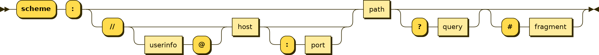
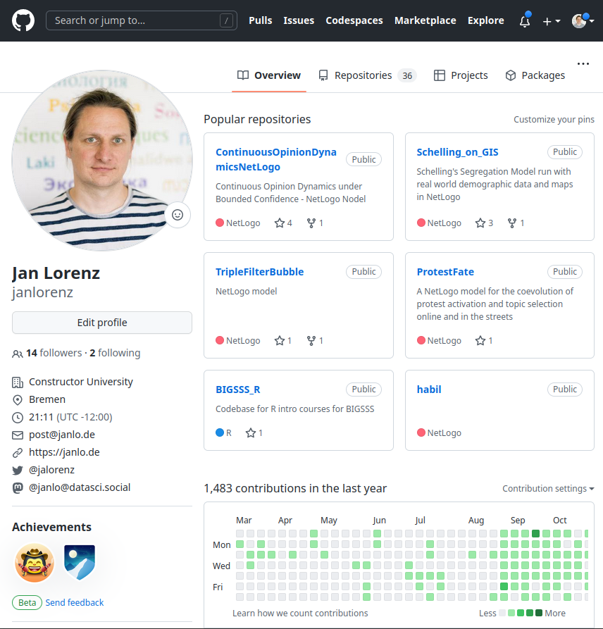

# Preliminaries

1. Get the file `CollectingData_TutorialCodeFile.R` and make a copy `CollectingData_TutorialCodeFile_YOURNAME.R`. Two ways:
    a. Go to the file's page <https://github.com/CU-S25-MSDSSB-DSCI-01-DataScienceLab/Course-Organization-Resources/blob/main/CollectingData_TutorialCodeFile.R> and download
    b. In RStudio clone the repository Course-Organization <https://github.com/CU-S25-MSDSSB-DSCI-01-DataScienceLab/Course-Organization-Resources>
2. Open this presentation locally to copy code from
3. Install some packages `install.packages("bigrquery","tidyjson")` (It is assumed you have the `tidyverse` package, which includes the packages `glue` and `rvest`. Check in the Packages tab that you have `rvest` Version 1.0.4. If not, update. )
<!-- 5. Install the Google chrome browser extension [**Selector Gadget**](https://chrome.google.com/webstore/detail/selectorgadget/mhjhnkcfbdhnjickkkdbjoemdmbfginb?hl=en) (Open the link in Google Chrome and select to install.) -->


# This tutorial

- Shows you ways to **retrieve data from the internet**
- Starts from practical problems
- Is really **hands-on to reach a solution**. Try to follow along!
- Makes some inputs to discuss **background knowledge**

. . . 

**Disclaimer:** I am not an specialist! I showcase how to approach retrieval problems with limited knowledge using the right mix of searching, learning, trial and error analysis, and endurance. 

- **Ask questions!**


# The three problems

1. Retrieve USA baby names from *Google Cloud BigQuery* using **SQL**
  - Make a plot showing the popularity of two names
2. Retrieve Profile and Social Network data from *GitHub* using the **API** and extracting from **JSON** 
  - Compare the number of followers of a user to the number of followers of a user's following
3. Retrieve distributions of movie ratings from *IMDb* and *letterboxd* using **HTML/CSS** scraping with **rvest**
  - Compare how the distributions for *Barbie* and *Oppenheimer* (2023) differ on the two platforms
  


# Problem 1: USA baby names from Google Cloud BigQuery (SQL)

## Google Cloud BigQuery Public Datasets

- We use the [Google Cloud Platform](https://en.wikipedia.org/wiki/Google_Cloud_Platform) which offers several cloud computing services based on Google's infrastructure.
- We use the service [BigQuery](https://cloud.google.com/bigquery) which is the [data warehouse](https://en.wikipedia.org/wiki/Data_warehouse) of Google Cloud.
- There is a sandbox mode which does not require anymore than a Google Account. (No Free Trial registration or Credit Card Details necessary) <https://console.cloud.google.com/bigquery>

  
## Google Cloud BigQuery Sandbox

There is a sandbox mode which does not require anymore than a *Google Account*. No Free Trial registration or Credit Card Details necessary.

1. Go to <https://console.cloud.google.com/bigquery>. If necessary, log in with a Google Account.
2. Click on "Create Project". Leaving the default specification. Create the project. 
3. Go to the "SQL workspace" (if you are not already there)
4. In the "Explorer" click "Add Data", select "Public Datasets", search for "usa names", click on the data set "USA Names", and then "View Dataset". 
4. The `bigquery-public-data` should appear in the Explorer. 
5. Use pressing the triangle to navigate the hierarchy in the Explorer. Go to the dataset `usa_names` and then click on its table `usa_1910_2013`. To the right should appear a tab with information about the table. 

## USA Names dataset in BigQuery


## Input: Databases and SQL

- Structured Query Language (SQL) is a language to query [relational databases](https://en.wikipedia.org/wiki/Relational_database). 
- A relational database
  1. presents data to users in the form of a collection of tables with rows and columns, and
  2. provides relational operators to manipulate the data in tabular form.
- SQL is somehow a standard but may come in different flavors
- Some call it "S,Q,L", other "SEQUEL"

 

## Input: Database = data frame?

- Tables in a database are indeed essentially the same as data frames in R, or python-pandas.

**What is the different use cases?**

- SQL databases are  
  - for storing and querying **large** amounts of data
  - often being access through a network 
  - often so large to be distributed over several severs
- The data frames in our data science tools are for smaller datasets to manipulate and analyze then within a programming environment and typically in memory. 


## Let's do a SQL query on USA Names!

On the BigQuery interface The tab for the table `usa_1910_2013` shows

- The table **Schema** which shows names and data types of the **columns**.   
  What are the columns in USA Names?
- Some **Details** about the data in the table: Metadate and data about Storage
- A **preview** of the first rows of the table

1. Select "Query" --> "In split tab" to open a new tab for our query. 
2. We want to extract the numbers of babies with the name "Kevin" for each year in the whole USA.
3. Copy this query

```sql
SELECT year, sum(number) AS num
FROM `bigquery-public-data.usa_names.usa_1910_2013`
WHERE name = "Kevin"
GROUP BY year
```

4. Click "Run" and explore the results. 
 
 
## Explanations

```sql
SELECT year, sum(number) AS num
FROM `bigquery-public-data.usa_names.usa_1910_2013`
WHERE name = "Kevin"
GROUP BY year
```

- Line 1 specifies what columns we want to have. It also specifies that we compute a new variable `num` which is the sum of `number`. To that end, we need some `GROUP BY` which comes later in Line 4.
- Line 2 specifies the data table. Note the dot-notation with the database collection `bigquery-public-data`, the database `usa_names`, and the table `usa_1910_2013`
- Line 3 specifies a filter
- The line breaks are not relevant for the execution.  
- The UPPERCASE of the syntax words is not necessary and only a convention.


## Query from R {.nostretch}

Now, let's do the same query from R using a copy of the script `Tutorials/CollectingData_YOURNAME.R`.

1. Load the package `bigrquery`
2. Execute the `bq_auth()` command (check the text in the comments)
3. Use this code

```R
billing <- "blabla-380021"  # This must be your project ID! 
sql <- "SELECT year, sum(number
FROM `bigquery-public-data.usa_names.usa_1910_2013`
WHERE name = 'Kevin'
GROUP BY year"
tb <- bq_project_query(billing, sql)
data <- bq_table_download(tb, n_max = 100)
```

**Important:** Replace the `billing` string with your project ID. Find it clicking here 

{width=20%}

## Plot the data in R

Now we can look at the evolution of the popularity of the name "Kevin" with 

```R
data |> ggplot(aes(year, num, color = name)) + geom_line()
```

. . .

Next challenge: Extract also the data for the name "Martin". Hint: You need to add "Martin" (comma-separated) to the `SELECT` and add a condition with `OR` at the end of the `WHERE`. You also need to add `name` to the `GROUP BY`. 


## Learing SQL

Suppose we have the data frame `usa_names` in R or python. Then the same data wrangling operations are quite similar. 

:::: {.columns}

::: {.column width='33%'}
### SQL

```sql
SELECT year, sum(number) AS num
FROM `bigquery-public-data.usa_names.usa_1910_2013`
WHERE name = "Kevin"
GROUP BY year
```
:::
::: {.column width='33%'}
### R dplyr
```R
usa_names |> 
filter(name == "Kevin") |> 
select(year, number) |> 
group_by(year) |> 
summarize(num = sum(number))
```
:::
::: {.column width='33%'}
### py pandas
```python
usa_names.loc[usa_names['name'] == 'Kevin', 
['year', 'number']].\
groupby('year').\
agg(num=('number', 'sum'))
```
:::

- There are libraries for linking python or R to SQL databases
  - Use these when your data is in a database anyway
- It may even make sense to make some computations in a SQL query (often much faster!)
- **SQL skills are useful (often must-have) for data scientists!** Whenever there is an opportunity to learn a bit of SQL, take it!
- Basics are not too complicated. AI tools can help to translate!
::::


# Project 2: Get information about users from GitHub API

## Input: URL structure




Example: 
`https://www.example.com:8080/path/to/resource?q=search+terms#section-title`

- Scheme: `https://`
- Hostname: `www.example.com`
- Port: `:8080` (optional component)
- Path: `/path/to/resource` (typically an html-file like `index.html`)
- Query String: `?q=search+terms` (optional component - it is used to pass additional data to the server, typically in the form of key-value pairs separated by `&`)
- Fragment Identifier: `#section-title` (this is an optional component - it is used to identify a specific section or location within the resource that the URL points to)

## Input: URL Structure Examples 


- The graphic is from the section <https://en.wikipedia.org/wiki/URL#Syntax> (Note the fragment)
- <https://www.google.com/maps?q=Constructor+University&t=k> (Note the query, `t=k` specifies satellite map)


## Input: Hostnames

- An essential part of a URL is the *hostname*. See <https://en.wikipedia.org/wiki/Hostname>. The hostname of this URL is `en.wikipedia.org`
- Hostnames are linked to [IP-Addresses](https://en.wikipedia.org/wiki/IP_address) through the [Domain Name System (DNS)](https://en.wikipedia.org/wiki/Domain_Name_System). 
  - Check <http://uni-bremen.de> and <http://134.102.22.124>
- Hostnames (and other things in URLs) are *case-insensitive*: lowercase = LOWERCASE
  - Check <http://janlo.de> and <http://JANLO.DE>
- Hostnames have the top of the hierarchy at the end: `subdomain.domain.top-level-domain`. 
  - This order is reverse to file-paths!  
  `/root/parent/child/file` vs.    
  `child.parent.root/file`


## Webpage 

<https://github.com/janlorenz>

:::: {.columns}

::: {.column width='33%'}
### Webpage


:::
::: {.column width='33%' height='50%}
### html

```html


<!DOCTYPE html>
<html lang="en" data-color-mode="auto" data-light-theme="light" data-dark-theme="dark" data-a11y-animated-images="system">
  <head>
    <meta charset="utf-8">
  <link rel="dns-prefetch" href="https://github.githubassets.com">
  <link rel="dns-prefetch" href="https://avatars.githubusercontent.com">
  <link rel="dns-prefetch" href="https://github-cloud.s3.amazonaws.com">
  <link rel="dns-prefetch" href="https://user-images.githubusercontent.com/">
  <link rel="preconnect" href="https://github.githubassets.com" crossorigin>
  <link rel="preconnect" href="https://avatars.githubusercontent.com">

  <link crossorigin="anonymous" media="all" rel="stylesheet" href="https://github.githubassets.com/assets/light-fe3f886b577a.css" /><link crossorigin="anonymous" media="all" rel="stylesheet" href="https://github.githubassets.com/assets/dark-a1dbeda2886c.css" /><link data-color-theme="dark_dimmed" crossorigin="anonymous" media="all" rel="stylesheet" data-href="https://github.githubassets.com/assets/dark_dimmed-1ad5cf51dfeb.css" /><link data-color-theme="dark_high_contrast" crossorigin="anonymous" media="all" rel="stylesheet" data-href="https://github.githubassets.com/assets/dark_high_contrast-11d3505dc06a.css" /><link data-color-theme="dark_colorblind" crossorigin="anonymous" media="all" rel="stylesheet" data-href="https://github.githubassets.com/assets/dark_colorblind-8b800495504f.css" /><link data-color-theme="light_colorblind" crossorigin="anonymous" media="all" rel="stylesheet" data-href="https://github.githubassets.com/assets/light_colorblind-daa38c88b795.css" /><link data-color-theme="light_high_contrast" crossorigin="anonymous" media="all" rel="stylesheet" data-href="https://github.githubassets.com/assets/light_high_contrast-1b9ea565820a.css" /><link data-color-theme="light_tritanopia" crossorigin="anonymous" media="all" rel="stylesheet" data-href="https://github.githubassets.com/assets/light_tritanopia-e4be9332dd6c.css" /><link data-color-theme="dark_tritanopia" crossorigin="anonymous" media="all" rel="stylesheet" data-href="https://github.githubassets.com/assets/dark_tritanopia-0dcf95848dd5.css" />
  
  
    <link crossorigin="anonymous" media="all" rel="stylesheet" href="https://github.githubassets.com/assets/primer-c581c4e461bb.css" />
    <link crossorigin="anonymous" media="all" rel="stylesheet" href="https://github.githubassets.com/assets/global-57fbee0c477b.css" />
    <link crossorigin="anonymous" media="all" rel="stylesheet" href="https://github.githubassets.com/assets/github-0485c151ab71.css" />
  <link crossorigin="anonymous" media="all" rel="stylesheet" href="https://github.githubassets.com/assets/profile-085697a49485.css" />


  <script crossorigin="anonymous" defer="defer" type="application/javascript" src="https://github.githubassets.com/assets/wp-runtime-e59b9a7db8fe.js"></script>
<script crossorigin="anonymous" defer="defer" type="application/javascript" src="https://github.githubassets.com/assets/vendors-node_modules_stacktrace-parser_dist_stack-trace-parser_esm_js-node_modules_github_bro-327bbf-fe611eb551b1.js"></script>
<script crossorigin="anonymous" defer="defer" type="application/javascript" src="https://github.githubassets.com/assets/ui_packages_soft-nav_soft-nav_ts-65c0a1a3eb40.js"></script>
<script crossorigin="anonymous" defer="defer" type="application/javascript" src="https://github.githubassets.com/assets/environment-10cb150f2afe.js"></script>
<script crossorigin="anonymous" defer="defer" type="application/javascript" src="https://github.githubassets.com/assets/vendors-node_modules_github_selector-observer_dist_index_esm_js-2646a2c533e3.js"></script>
<script crossorigin="anonymous" defer="defer" type="application/javascript" src="https://github.githubassets.com/assets/vendors-node_modules_delegated-events_dist_index_js-node_modules_github_details-dialog-elemen-63debe-c04540d458d4.js"></script>
<script crossorigin="anonymous" defer="defer" type="application/javascript" src="https://github.githubassets.com/assets/vendors-node_modules_github_relative-time-element_dist_index_js-52e1ce026ad1.js"></script>
<script crossorigin="anonymous" defer="defer" type="application/javascript" src="https://github.githubassets.com/assets/vendors-node_modules_fzy_js_index_js-node_modules_github_markdown-toolbar-element_dist_index_js-e3de700a4c9d.js"></script>
<script crossorigin="anonymous" defer="defer" type="application/javascript" src="https://github.githubassets.com/assets/vendors-node_modules_github_auto-complete-element_dist_index_js-node_modules_github_catalyst_-6afc16-e779583c369f.js"></script>
<script crossorigin="anonymous" defer="defer" type="application/javascript" src="https://github.githubassets.com/assets/vendors-node_modules_github_file-attachment-element_dist_index_js-node_modules_github_text-ex-3415a8-7ecc10fb88d0.js"></script>
<script crossorigin="anonymous" defer="defer" type="application/javascript" src="https://github.githubassets.com/assets/vendors-node_modules_github_filter-input-element_dist_index_js-node_modules_github_remote-inp-79182d-befd2b2f5880.js"></script>
<script crossorigin="anonymous" defer="defer" type="application/javascript" src="https://github.githubassets.com/assets/vendors-node_modules_primer_view-components_app_components_primer_primer_js-node_modules_gith-6a1af4-ec6fc1a7364a.js"></script>
<script crossorigin="anonymous" defer="defer" type="application/javascript" src="https://github.githubassets.com/assets/github-elements-fc0e0b89822a.js"></script>
<script crossorigin="anonymous" defer="defer" type="application/javascript" src="https://github.githubassets.com/assets/element-registry-4a600a4a3b31.js"></script>
<script crossorigin="anonymous" defer="defer" type="application/javascript" src="https://github.githubassets.com/assets/vendors-node_modules_lit-html_lit-html_js-9d9fe1859ce5.js"></script>
<script crossorigin="anonymous" defer="defer" type="application/javascript" src="https://github.githubassets.com/assets/vendors-node_modules_manuelpuyol_turbo_dist_turbo_es2017-esm_js-4140d67f0cc2.js"></script>
<script crossorigin="anonymous" defer="defer" type="application/javascript" src="https://github.githubassets.com/assets/vendors-node_modules_github_mini-throttle_dist_index_js-node_modules_github_alive-client_dist-bf5aa2-424aa982deef.js"></script>
<script crossorigin="anonymous" defer="defer" type="application/javascript" src="https://github.githubassets.com/assets/vendors-node_modules_primer_behaviors_dist_esm_dimensions_js-node_modules_github_hotkey_dist_-9fc4f4-d434ddaf3207.js"></script>
<script crossorigin="anonymous" defer="defer" type="application/javascript" src="https://github.githubassets.com/assets/vendors-node_modules_color-convert_index_js-35b3ae68c408.js"></script>
<script crossorigin="anonymous" defer="defer" type="application/javascript" src="https://github.githubassets.com/assets/vendors-node_modules_github_remote-form_dist_index_js-node_modules_github_session-resume_dist-def857-2a32d97c93c5.js"></script>
<script crossorigin="anonymous" defer="defer" type="application/javascript" src="https://github.githubassets.com/assets/vendors-node_modules_github_paste-markdown_dist_index_esm_js-node_modules_github_quote-select-15ddcc-1512e06cfee0.js"></script>
<script crossorigin="anonymous" defer="defer" type="application/javascript" src="https://github.githubassets.com/assets/app_assets_modules_github_updatable-content_ts-430cacb5f7df.js"></script>
<script crossorigin="anonymous" defer="defer" type="application/javascript" src="https://github.githubassets.com/assets/app_assets_modules_github_behaviors_keyboard-shortcuts-helper_ts-app_assets_modules_github_be-f5afdb-5b2007cdf918.js"></script>
<script crossorigin="anonymous" defer="defer" type="application/javascript" src="https://github.githubassets.com/assets/app_assets_modules_github_sticky-scroll-into-view_ts-737bcded84e3.js"></script>
<script crossorigin="anonymous" defer="defer" type="application/javascript" src="https://github.githubassets.com/assets/app_assets_modules_github_behaviors_include-fragment_ts-app_assets_modules_github_behaviors_r-4077b4-c009cc5472ac.js"></script>
<script crossorigin="anonymous" defer="defer" type="application/javascript" src="https://github.githubassets.com/assets/app_assets_modules_github_behaviors_commenting_edit_ts-app_assets_modules_github_behaviors_ht-83c235-30c68bad2844.js"></script>
<script crossorigin="anonymous" defer="defer" type="application/javascript" src="https://github.githubassets.com/assets/behaviors-e4b7d4dc2a31.js"></script>
<script crossorigin="anonymous" defer="defer" type="application/javascript" src="https://github.githubassets.com/assets/vendors-node_modules_delegated-events_dist_index_js-node_modules_github_catalyst_lib_index_js-06ff531-32d7d1e94817.js"></script>
<script crossorigin="anonymous" defer="defer" type="application/javascript" src="https://github.githubassets.com/assets/notifications-global-f5b58d24780b.js"></script>
<script crossorigin="anonymous" defer="defer" type="application/javascript" src="https://github.githubassets.com/assets/vendors-node_modules_primer_behaviors_dist_esm_focus-zone_js-d55308df5023.js"></script>
<script crossorigin="anonymous" defer="defer" type="application/javascript" src="https://github.githubassets.com/assets/vendors-node_modules_github_remote-form_dist_index_js-node_modules_primer_behaviors_dist_esm_-b34105-c2daa8698316.js"></script>
<script crossorigin="anonymous" defer="defer" type="application/javascript" src="https://github.githubassets.com/assets/profile-b5acccb095f5.js"></script>
  

  <title>janlorenz (Jan Lorenz) · GitHub</title>


  <meta name="route-pattern" content="/:user_id(.:format)">

    
  <meta name="current-catalog-service-hash" content="4a1c50a83cf6cc4b55b6b9c53e553e3f847c876b87fb333f71f5d05db8f1a7db">


  <meta name="request-id" content="C5B4:6464:820AAD0:85EA185:6409A58D" data-pjax-transient="true"/><meta name="html-safe-nonce" content="d427c0738d9b56f38d060a9b907607a13d12687a0da31495476f2ed9851e74cc" data-pjax-transient="true"/><meta name="visitor-payload" content="eyJyZWZlcnJlciI6IiIsInJlcXVlc3RfaWQiOiJDNUI0OjY0NjQ6ODIwQUFEMDo4NUVBMTg1OjY0MDlBNThEIiwidmlzaXRvcl9pZCI6IjUzMjgzMzcyNjAyNDQ5MjQyOSIsInJlZ2lvbl9lZGdlIjoiZnJhIiwicmVnaW9uX3JlbmRlciI6ImZyYSJ9" data-pjax-transient="true"/><meta name="visitor-hmac" content="a7507dcc7c07f150c5dd746f03e2c01ffcd592ab9657ec0ac8c65ebc792c736d" data-pjax-transient="true"/>


  <meta name="github-keyboard-shortcuts" content="" data-turbo-transient="true" />
  

  <meta name="selected-link" value="overview" data-turbo-transient>

    <meta name="google-site-verification" content="c1kuD-K2HIVF635lypcsWPoD4kilo5-jA_wBFyT4uMY">
  <meta name="google-site-verification" content="KT5gs8h0wvaagLKAVWq8bbeNwnZZK1r1XQysX3xurLU">
  <meta name="google-site-verification" content="ZzhVyEFwb7w3e0-uOTltm8Jsck2F5StVihD0exw2fsA">
  <meta name="google-site-verification" content="GXs5KoUUkNCoaAZn7wPN-t01Pywp9M3sEjnt_3_ZWPc">
  <meta name="google-site-verification" content="Apib7-x98H0j5cPqHWwSMm6dNU4GmODRoqxLiDzdx9I">

<meta name="octolytics-url" content="https://collector.github.com/github/collect" />

  <meta name="analytics-location" content="/&lt;user-name&gt;" data-turbo-transient="true" />

  


  

    <meta name="user-login" content="">

  

    <meta name="viewport" content="width=device-width">
    
      <meta name="description" content="janlorenz has 21 repositories available. Follow their code on GitHub.">
      <link rel="search" type="application/opensearchdescription+xml" href="/opensearch.xml" title="GitHub">
    <link rel="fluid-icon" href="https://github.com/fluidicon.png" title="GitHub">
    <meta property="fb:app_id" content="1401488693436528">
    <meta name="apple-itunes-app" content="app-id=1477376905" />
      <meta name="twitter:image:src" content="https://avatars.githubusercontent.com/u/7503499?v=4?s=400" /><meta name="twitter:site" content="@github" /><meta name="twitter:card" content="summary" /><meta name="twitter:title" content="janlorenz - Overview" /><meta name="twitter:description" content="janlorenz has 21 repositories available. Follow their code on GitHub." />
      <meta property="og:image" content="https://avatars.githubusercontent.com/u/7503499?v=4?s=400" /><meta property="og:image:alt" content="janlorenz has 21 repositories available. Follow their code on GitHub." /><meta property="og:site_name" content="GitHub" /><meta property="og:type" content="profile" /><meta property="og:title" content="janlorenz - Overview" /><meta property="og:url" content="https://github.com/janlorenz" /><meta property="og:description" content="janlorenz has 21 repositories available. Follow their code on GitHub." /><meta property="profile:username" content="janlorenz" />
      
    <link rel="assets" href="https://github.githubassets.com/">


        <meta name="hostname" content="github.com">


        <meta name="expected-hostname" content="github.com">

    <meta name="enabled-features" content="TURBO_EXPERIMENT_RISKY,IMAGE_METRIC_TRACKING,GEOJSON_AZURE_MAPS">


  <meta http-equiv="x-pjax-version" content="dc62f9ebb6f4c950ab02f5ec7850fe084bbf811f28e5dc1d213224a7b2a9c99c" data-turbo-track="reload">
  <meta http-equiv="x-pjax-csp-version" content="2a84822a832da97f1ea76cf989a357ec70c85713a2fd8f14c8421b76bbffe38c" data-turbo-track="reload">
  <meta http-equiv="x-pjax-css-version" content="78e7b8f70ebad58f9bb289d9b9b52d11a17b6b18a49bbc218aa147a8d9c802c2" data-turbo-track="reload">
  <meta http-equiv="x-pjax-js-version" content="2bb2a1981a6549755736c5c658d791278a3281bcb10ae01b525143eb739b628b" data-turbo-track="reload">

  <meta name="turbo-cache-control" content="no-preview" data-turbo-transient="">

    <meta name="octolytics-dimension-user_id" content="7503499" /><meta name="octolytics-dimension-user_login" content="janlorenz" />


  <meta name="turbo-body-classes" content="logged-out env-production page-responsive page-profile">


  <meta name="browser-stats-url" content="https://api.github.com/_private/browser/stats">

  <meta name="browser-errors-url" content="https://api.github.com/_private/browser/errors">

  <meta name="browser-optimizely-client-errors-url" content="https://api.github.com/_private/browser/optimizely_client/errors">

  <link rel="mask-icon" href="https://github.githubassets.com/pinned-octocat.svg" color="#000000">
  <link rel="alternate icon" class="js-site-favicon" type="image/png" href="https://github.githubassets.com/favicons/favicon.png">
  <link rel="icon" class="js-site-favicon" type="image/svg+xml" href="https://github.githubassets.com/favicons/favicon.svg">

<meta name="theme-color" content="#1e2327">
<meta name="color-scheme" content="light dark" />


  <link rel="manifest" href="/manifest.json" crossOrigin="use-credentials">

  </head>

  <body class="logged-out env-production page-responsive page-profile" style="word-wrap: break-word;">
    <div data-turbo-body class="logged-out env-production page-responsive page-profile" style="word-wrap: break-word;">
      


    <div class="position-relative js-header-wrapper ">
      <a href="#start-of-content" class="px-2 py-4 color-bg-accent-emphasis color-fg-on-emphasis show-on-focus js-skip-to-content">Skip to content</a>
      <span data-view-component="true" class="progress-pjax-loader Progress position-fixed width-full">
    <span style="width: 0%;" data-view-component="true" class="Progress-item progress-pjax-loader-bar left-0 top-0 color-bg-accent-emphasis"></span>
</span>      
      


        

            <script crossorigin="anonymous" defer="defer" type="application/javascript" src="https://github.githubassets.com/assets/vendors-node_modules_github_remote-form_dist_index_js-node_modules_delegated-events_dist_inde-94fd67-04fa93bb158a.js"></script>
<script crossorigin="anonymous" defer="defer" type="application/javascript" src="https://github.githubassets.com/assets/sessions-9a357800426b.js"></script>
<header class="Header-old header-logged-out js-details-container Details position-relative f4 py-3" role="banner">
  <button type="button" class="Header-backdrop d-lg-none border-0 position-fixed top-0 left-0 width-full height-full js-details-target" aria-label="Toggle navigation">
    <span class="d-none">Toggle navigation</span>
  </button>

  <div class="container-xl d-flex flex-column flex-lg-row flex-items-center p-responsive height-full position-relative z-1">
    <div class="d-flex flex-justify-between flex-items-center width-full width-lg-auto">
      <a class="mr-lg-3 color-fg-inherit flex-order-2" href="https://github.com/" aria-label="Homepage" data-ga-click="(Logged out) Header, go to homepage, icon:logo-wordmark">
        <svg height="32" aria-hidden="true" viewBox="0 0 16 16" version="1.1" width="32" data-view-component="true" class="octicon octicon-mark-github">
    <path fill-rule="evenodd" d="M8 0C3.58 0 0 3.58 0 8c0 3.54 2.29 6.53 5.47 7.59.4.07.55-.17.55-.38 0-.19-.01-.82-.01-1.49-2.01.37-2.53-.49-2.69-.94-.09-.23-.48-.94-.82-1.13-.28-.15-.68-.52-.01-.53.63-.01 1.08.58 1.23.82.72 1.21 1.87.87 2.33.66.07-.52.28-.87.51-1.07-1.78-.2-3.64-.89-3.64-3.95 0-.87.31-1.59.82-2.15-.08-.2-.36-1.02.08-2.12 0 0 .67-.21 2.2.82.64-.18 1.32-.27 2-.27.68 0 1.36.09 2 .27 1.53-1.04 2.2-.82 2.2-.82.44 1.1.16 1.92.08 2.12.51.56.82 1.27.82 2.15 0 3.07-1.87 3.75-3.65 3.95.29.25.54.73.54 1.48 0 1.07-.01 1.93-.01 2.2 0 .21.15.46.55.38A8.013 8.013 0 0016 8c0-4.42-3.58-8-8-8z"></path>
</svg>
      </a>

        <div class="flex-1">
          <a href="/signup?ref_cta=Sign+up&amp;ref_loc=header+logged+out&amp;ref_page=%2F%3Cuser-name%3E&amp;source=header"
            class="d-inline-block d-lg-none flex-order-1 f5 no-underline border color-border-default rounded-2 px-2 py-1 color-fg-inherit"
            data-hydro-click="{&quot;event_type&quot;:&quot;authentication.click&quot;,&quot;payload&quot;:{&quot;location_in_page&quot;:&quot;site header&quot;,&quot;repository_id&quot;:null,&quot;auth_type&quot;:&quot;SIGN_UP&quot;,&quot;originating_url&quot;:&quot;https://github.com/janlorenz&quot;,&quot;user_id&quot;:null}}" data-hydro-click-hmac="e73661b572037eb88f2c591f28e27566bc0ffacbf62156389a4a644e9337e93b"
          >
            Sign&nbsp;up
          </a>
        </div>

      <div class="flex-1 flex-order-2 text-right">
          <button aria-label="Toggle navigation" aria-expanded="false" type="button" data-view-component="true" class="js-details-target Button--link Button--medium Button d-lg-none color-fg-inherit p-1">    <span class="Button-content">
      <span class="Button-label"><div class="HeaderMenu-toggle-bar rounded my-1"></div>
            <div class="HeaderMenu-toggle-bar rounded my-1"></div>
            <div class="HeaderMenu-toggle-bar rounded my-1"></div></span>
    </span>
</button>  
      </div>
    </div>


    <div class="HeaderMenu--logged-out p-responsive height-fit position-lg-relative d-lg-flex flex-column flex-auto pt-7 pb-4 top-0">
      <div class="header-menu-wrapper d-flex flex-column flex-self-end flex-lg-row flex-justify-between flex-auto p-3 p-lg-0 rounded rounded-lg-0 mt-3 mt-lg-0">
          <nav class="mt-0 px-3 px-lg-0 mb-3 mb-lg-0" aria-label="Global">
            <ul class="d-lg-flex list-style-none">
                <li class="HeaderMenu-item position-relative flex-wrap flex-justify-between flex-items-center d-block d-lg-flex flex-lg-nowrap flex-lg-items-center js-details-container js-header-menu-item">
      <button type="button" class="HeaderMenu-link border-0 width-full width-lg-auto px-0 px-lg-2 py-3 py-lg-2 no-wrap d-flex flex-items-center flex-justify-between js-details-target" aria-expanded="false">
        Product
        <svg opacity="0.5" aria-hidden="true" height="16" viewBox="0 0 16 16" version="1.1" width="16" data-view-component="true" class="octicon octicon-chevron-down HeaderMenu-icon ml-1">
    <path fill-rule="evenodd" d="M12.78 6.22a.75.75 0 010 1.06l-4.25 4.25a.75.75 0 01-1.06 0L3.22 7.28a.75.75 0 011.06-1.06L8 9.94l3.72-3.72a.75.75 0 011.06 0z"></path>
</svg>
      </button>
      <div class="HeaderMenu-dropdown dropdown-menu rounded m-0 p-0 py-2 py-lg-4 position-relative position-lg-absolute left-0 left-lg-n3 d-lg-flex dropdown-menu-wide">
          <ul class="list-style-none f5 px-lg-4 border-lg-right mb-4 mb-lg-0 pr-lg-7">

              <li>
  <a class="HeaderMenu-dropdown-link lh-condensed d-block no-underline position-relative py-2 Link--secondary d-flex flex-items-center pb-lg-3" data-analytics-event="{&quot;category&quot;:&quot;Header dropdown (logged out), Product&quot;,&quot;action&quot;:&quot;click to go to Actions&quot;,&quot;label&quot;:&quot;ref_cta:Actions;&quot;}" href="/features/actions">
      <svg aria-hidden="true" height="24" viewBox="0 0 24 24" version="1.1" width="24" data-view-component="true" class="octicon octicon-workflow color-fg-subtle mr-3">
    <path fill-rule="evenodd" d="M1 3a2 2 0 012-2h6.5a2 2 0 012 2v6.5a2 2 0 01-2 2H7v4.063C7 16.355 7.644 17 8.438 17H12.5v-2.5a2 2 0 012-2H21a2 2 0 012 2V21a2 2 0 01-2 2h-6.5a2 2 0 01-2-2v-2.5H8.437A2.938 2.938 0 015.5 15.562V11.5H3a2 2 0 01-2-2V3zm2-.5a.5.5 0 00-.5.5v6.5a.5.5 0 00.5.5h6.5a.5.5 0 00.5-.5V3a.5.5 0 00-.5-.5H3zM14.5 14a.5.5 0 00-.5.5V21a.5.5 0 00.5.5H21a.5.5 0 00.5-.5v-6.5a.5.5 0 00-.5-.5h-6.5z"></path>
</svg>
      <div>
        <div class="color-fg-default h4">Actions</div>
        Automate any workflow
      </div>

    
</a></li>

              <li>
  <a class="HeaderMenu-dropdown-link lh-condensed d-block no-underline position-relative py-2 Link--secondary d-flex flex-items-center pb-lg-3" data-analytics-event="{&quot;category&quot;:&quot;Header dropdown (logged out), Product&quot;,&quot;action&quot;:&quot;click to go to Packages&quot;,&quot;label&quot;:&quot;ref_cta:Packages;&quot;}" href="/features/packages">
      <svg aria-hidden="true" height="24" viewBox="0 0 24 24" version="1.1" width="24" data-view-component="true" class="octicon octicon-package color-fg-subtle mr-3">
    <path fill-rule="evenodd" d="M12.876.64a1.75 1.75 0 00-1.75 0l-8.25 4.762a1.75 1.75 0 00-.875 1.515v9.525c0 .625.334 1.203.875 1.515l8.25 4.763a1.75 1.75 0 001.75 0l8.25-4.762a1.75 1.75 0 00.875-1.516V6.917a1.75 1.75 0 00-.875-1.515L12.876.639zm-1 1.298a.25.25 0 01.25 0l7.625 4.402-7.75 4.474-7.75-4.474 7.625-4.402zM3.501 7.64v8.803c0 .09.048.172.125.216l7.625 4.402v-8.947L3.501 7.64zm9.25 13.421l7.625-4.402a.25.25 0 00.125-.216V7.639l-7.75 4.474v8.947z"></path>
</svg>
      <div>
        <div class="color-fg-default h4">Packages</div>
        Host and manage packages
      </div>

    
</a></li>

              <li>
  <a class="HeaderMenu-dropdown-link lh-condensed d-block no-underline position-relative py-2 Link--secondary d-flex flex-items-center pb-lg-3" data-analytics-event="{&quot;category&quot;:&quot;Header dropdown (logged out), Product&quot;,&quot;action&quot;:&quot;click to go to Security&quot;,&quot;label&quot;:&quot;ref_cta:Security;&quot;}" href="/features/security">
      <svg aria-hidden="true" height="24" viewBox="0 0 24 24" version="1.1" width="24" data-view-component="true" class="octicon octicon-shield-check color-fg-subtle mr-3">
    <path d="M16.53 9.78a.75.75 0 00-1.06-1.06L11 13.19l-1.97-1.97a.75.75 0 00-1.06 1.06l2.5 2.5a.75.75 0 001.06 0l5-5z"></path><path fill-rule="evenodd" d="M12.54.637a1.75 1.75 0 00-1.08 0L3.21 3.312A1.75 1.75 0 002 4.976V10c0 6.19 3.77 10.705 9.401 12.83.386.145.812.145 1.198 0C18.229 20.704 22 16.19 22 10V4.976c0-.759-.49-1.43-1.21-1.664L12.54.637zm-.617 1.426a.25.25 0 01.154 0l8.25 2.676a.25.25 0 01.173.237V10c0 5.461-3.28 9.483-8.43 11.426a.2.2 0 01-.14 0C6.78 19.483 3.5 15.46 3.5 10V4.976c0-.108.069-.203.173-.237l8.25-2.676z"></path>
</svg>
      <div>
        <div class="color-fg-default h4">Security</div>
        Find and fix vulnerabilities
      </div>

    
</a></li>

              <li>
  <a class="HeaderMenu-dropdown-link lh-condensed d-block no-underline position-relative py-2 Link--secondary d-flex flex-items-center pb-lg-3" data-analytics-event="{&quot;category&quot;:&quot;Header dropdown (logged out), Product&quot;,&quot;action&quot;:&quot;click to go to Codespaces&quot;,&quot;label&quot;:&quot;ref_cta:Codespaces;&quot;}" href="/features/codespaces">
      <svg aria-hidden="true" height="24" viewBox="0 0 24 24" version="1.1" width="24" data-view-component="true" class="octicon octicon-codespaces color-fg-subtle mr-3">
    <path fill-rule="evenodd" d="M3.5 3.75C3.5 2.784 4.284 2 5.25 2h13.5c.966 0 1.75.784 1.75 1.75v7.5A1.75 1.75 0 0118.75 13H5.25a1.75 1.75 0 01-1.75-1.75v-7.5zm1.75-.25a.25.25 0 00-.25.25v7.5c0 .138.112.25.25.25h13.5a.25.25 0 00.25-.25v-7.5a.25.25 0 00-.25-.25H5.25zM1.5 15.75c0-.966.784-1.75 1.75-1.75h17.5c.966 0 1.75.784 1.75 1.75v4a1.75 1.75 0 01-1.75 1.75H3.25a1.75 1.75 0 01-1.75-1.75v-4zm1.75-.25a.25.25 0 00-.25.25v4c0 .138.112.25.25.25h17.5a.25.25 0 00.25-.25v-4a.25.25 0 00-.25-.25H3.25z"></path><path fill-rule="evenodd" d="M10 17.75a.75.75 0 01.75-.75h6.5a.75.75 0 010 1.5h-6.5a.75.75 0 01-.75-.75zm-4 0a.75.75 0 01.75-.75h.5a.75.75 0 010 1.5h-.5a.75.75 0 01-.75-.75z"></path>
</svg>
      <div>
        <div class="color-fg-default h4">Codespaces</div>
        Instant dev environments
      </div>

    
</a></li>

              <li>
  <a class="HeaderMenu-dropdown-link lh-condensed d-block no-underline position-relative py-2 Link--secondary d-flex flex-items-center pb-lg-3" data-analytics-event="{&quot;category&quot;:&quot;Header dropdown (logged out), Product&quot;,&quot;action&quot;:&quot;click to go to Copilot&quot;,&quot;label&quot;:&quot;ref_cta:Copilot;&quot;}" href="/features/copilot">
      <svg aria-hidden="true" height="24" viewBox="0 0 24 24" version="1.1" width="24" data-view-component="true" class="octicon octicon-copilot color-fg-subtle mr-3">
    <path d="M9.75 14a.75.75 0 01.75.75v2.5a.75.75 0 01-1.5 0v-2.5a.75.75 0 01.75-.75zm4.5 0a.75.75 0 01.75.75v2.5a.75.75 0 01-1.5 0v-2.5a.75.75 0 01.75-.75z"></path><path fill-rule="evenodd" d="M12 2c-2.214 0-4.248.657-5.747 1.756a7.43 7.43 0 00-.397.312c-.584.235-1.077.546-1.474.952-.85.87-1.132 2.037-1.132 3.368 0 .368.014.733.052 1.086l-.633 1.478-.043.022A4.75 4.75 0 000 15.222v1.028c0 .529.31.987.564 1.293.28.336.637.653.967.918a13.262 13.262 0 001.299.911l.024.015.006.004.04.025.144.087c.124.073.304.177.535.3.46.245 1.122.57 1.942.894C7.155 21.344 9.439 22 12 22s4.845-.656 6.48-1.303c.819-.324 1.481-.65 1.941-.895a13.797 13.797 0 00.68-.386l.039-.025.006-.004.024-.015a8.829 8.829 0 00.387-.248c.245-.164.577-.396.912-.663.33-.265.686-.582.966-.918.256-.306.565-.764.565-1.293v-1.028a4.75 4.75 0 00-2.626-4.248l-.043-.022-.633-1.478c.038-.353.052-.718.052-1.086 0-1.331-.282-2.499-1.132-3.368-.397-.406-.89-.717-1.474-.952a7.386 7.386 0 00-.397-.312C16.248 2.657 14.214 2 12 2zm-8 9.654l.038-.09c.046.06.094.12.145.177.793.9 2.057 1.259 3.782 1.259 1.59 0 2.739-.544 3.508-1.492.131-.161.249-.331.355-.508a32.948 32.948 0 00.344 0c.106.177.224.347.355.508.77.948 1.918 1.492 3.508 1.492 1.725 0 2.989-.359 3.782-1.259.05-.057.099-.116.145-.177l.038.09v6.669a17.618 17.618 0 01-2.073.98C16.405 19.906 14.314 20.5 12 20.5c-2.314 0-4.405-.594-5.927-1.197A17.62 17.62 0 014 18.323v-6.67zm6.309-1.092a2.35 2.35 0 01-.38.374c-.437.341-1.054.564-1.964.564-1.573 0-2.292-.337-2.657-.75-.192-.218-.331-.506-.423-.89-.091-.385-.135-.867-.135-1.472 0-1.14.243-1.847.705-2.32.477-.487 1.319-.861 2.824-1.024 1.487-.16 2.192.138 2.533.529l.008.01c.264.308.429.806.43 1.568v.031a7.203 7.203 0 01-.09 1.079c-.143.967-.406 1.754-.851 2.301zm2.504-2.497a7.174 7.174 0 01-.063-.894v-.02c.001-.77.17-1.27.438-1.578.341-.39 1.046-.69 2.533-.529 1.506.163 2.347.537 2.824 1.025.462.472.705 1.179.705 2.319 0 1.21-.174 1.926-.558 2.361-.365.414-1.084.751-2.657.751-1.21 0-1.902-.393-2.344-.938-.475-.584-.742-1.44-.878-2.497z"></path>
</svg>
      <div>
        <div class="color-fg-default h4">Copilot</div>
        Write better code with AI
      </div>

    
</a></li>

              <li>
  <a class="HeaderMenu-dropdown-link lh-condensed d-block no-underline position-relative py-2 Link--secondary d-flex flex-items-center pb-lg-3" data-analytics-event="{&quot;category&quot;:&quot;Header dropdown (logged out), Product&quot;,&quot;action&quot;:&quot;click to go to Code review&quot;,&quot;label&quot;:&quot;ref_cta:Code review;&quot;}" href="/features/code-review">
      <svg aria-hidden="true" height="24" viewBox="0 0 24 24" version="1.1" width="24" data-view-component="true" class="octicon octicon-code-review color-fg-subtle mr-3">
    <path d="M10.3 6.74a.75.75 0 01-.04 1.06l-2.908 2.7 2.908 2.7a.75.75 0 11-1.02 1.1l-3.5-3.25a.75.75 0 010-1.1l3.5-3.25a.75.75 0 011.06.04zm3.44 1.06a.75.75 0 111.02-1.1l3.5 3.25a.75.75 0 010 1.1l-3.5 3.25a.75.75 0 11-1.02-1.1l2.908-2.7-2.908-2.7z"></path><path fill-rule="evenodd" d="M1.5 4.25c0-.966.784-1.75 1.75-1.75h17.5c.966 0 1.75.784 1.75 1.75v12.5a1.75 1.75 0 01-1.75 1.75h-9.69l-3.573 3.573A1.457 1.457 0 015 21.043V18.5H3.25a1.75 1.75 0 01-1.75-1.75V4.25zM3.25 4a.25.25 0 00-.25.25v12.5c0 .138.112.25.25.25h2.5a.75.75 0 01.75.75v3.19l3.72-3.72a.75.75 0 01.53-.22h10a.25.25 0 00.25-.25V4.25a.25.25 0 00-.25-.25H3.25z"></path>
</svg>
      <div>
        <div class="color-fg-default h4">Code review</div>
        Manage code changes
      </div>

    
</a></li>

              <li>
  <a class="HeaderMenu-dropdown-link lh-condensed d-block no-underline position-relative py-2 Link--secondary d-flex flex-items-center pb-lg-3" data-analytics-event="{&quot;category&quot;:&quot;Header dropdown (logged out), Product&quot;,&quot;action&quot;:&quot;click to go to Issues&quot;,&quot;label&quot;:&quot;ref_cta:Issues;&quot;}" href="/features/issues">
      <svg aria-hidden="true" height="24" viewBox="0 0 24 24" version="1.1" width="24" data-view-component="true" class="octicon octicon-issue-opened color-fg-subtle mr-3">
    <path fill-rule="evenodd" d="M2.5 12a9.5 9.5 0 1119 0 9.5 9.5 0 01-19 0zM12 1C5.925 1 1 5.925 1 12s4.925 11 11 11 11-4.925 11-11S18.075 1 12 1zm0 13a2 2 0 100-4 2 2 0 000 4z"></path>
</svg>
      <div>
        <div class="color-fg-default h4">Issues</div>
        Plan and track work
      </div>

    
</a></li>

              <li>
  <a class="HeaderMenu-dropdown-link lh-condensed d-block no-underline position-relative py-2 Link--secondary d-flex flex-items-center" data-analytics-event="{&quot;category&quot;:&quot;Header dropdown (logged out), Product&quot;,&quot;action&quot;:&quot;click to go to Discussions&quot;,&quot;label&quot;:&quot;ref_cta:Discussions;&quot;}" href="/features/discussions">
      <svg aria-hidden="true" height="24" viewBox="0 0 24 24" version="1.1" width="24" data-view-component="true" class="octicon octicon-comment-discussion color-fg-subtle mr-3">
    <path fill-rule="evenodd" d="M1.75 1A1.75 1.75 0 000 2.75v9.5C0 13.216.784 14 1.75 14H3v1.543a1.457 1.457 0 002.487 1.03L8.061 14h6.189A1.75 1.75 0 0016 12.25v-9.5A1.75 1.75 0 0014.25 1H1.75zM1.5 2.75a.25.25 0 01.25-.25h12.5a.25.25 0 01.25.25v9.5a.25.25 0 01-.25.25h-6.5a.75.75 0 00-.53.22L4.5 15.44v-2.19a.75.75 0 00-.75-.75h-2a.25.25 0 01-.25-.25v-9.5z"></path><path d="M22.5 8.75a.25.25 0 00-.25-.25h-3.5a.75.75 0 010-1.5h3.5c.966 0 1.75.784 1.75 1.75v9.5A1.75 1.75 0 0122.25 20H21v1.543a1.457 1.457 0 01-2.487 1.03L15.939 20H10.75A1.75 1.75 0 019 18.25v-1.465a.75.75 0 011.5 0v1.465c0 .138.112.25.25.25h5.5a.75.75 0 01.53.22l2.72 2.72v-2.19a.75.75 0 01.75-.75h2a.25.25 0 00.25-.25v-9.5z"></path>
</svg>
      <div>
        <div class="color-fg-default h4">Discussions</div>
        Collaborate outside of code
      </div>
...
```
:::
::: {.column width='33%'}
### json
```json
{
  "login": "janlorenz",
  "id": 7503499,
  "node_id": "MDQ6VXNlcjc1MDM0OTk=",
  "avatar_url": "https://avatars.githubusercontent.com/u/7503499?v=4",
  "gravatar_id": "",
  "url": "https://api.github.com/users/janlorenz",
  "html_url": "https://github.com/janlorenz",
  "followers_url": "https://api.github.com/users/janlorenz/followers",
  "following_url": "https://api.github.com/users/janlorenz/following{/other_user}",
  "gists_url": "https://api.github.com/users/janlorenz/gists{/gist_id}",
  "starred_url": "https://api.github.com/users/janlorenz/starred{/owner}{/repo}",
  "subscriptions_url": "https://api.github.com/users/janlorenz/subscriptions",
  "organizations_url": "https://api.github.com/users/janlorenz/orgs",
  "repos_url": "https://api.github.com/users/janlorenz/repos",
  "events_url": "https://api.github.com/users/janlorenz/events{/privacy}",
  "received_events_url": "https://api.github.com/users/janlorenz/received_events",
  "type": "User",
  "site_admin": false,
  "name": "Jan Lorenz",
  "company": "Constructor University",
  "blog": "https://janlo.de",
  "location": "Bremen",
  "email": null,
  "hireable": null,
  "bio": null,
  "twitter_username": "jalorenz",
  "public_repos": 21,
  "public_gists": 0,
  "followers": 14,
  "following": 2,
  "created_at": "2014-05-06T17:55:13Z",
  "updated_at": "2023-02-25T13:02:51Z"
}
```
:::
::::

## Input: Website description languages

- **HTML** (Hypertext Markup Language): The essential language used for creating web pages and defining the structure and content of a website.

Almost all modern websites also include: 

- **CSS** (Cascading Style Sheets): Used for defining the visual style and layout of a website, including colors, fonts, and spacing.
- **JavaScript:** Used to add interactivity and dynamic functionality to web pages, such as animations, form validation, and interactive user interfaces on the client (=user) side.


## Input: Website description languages

Often CSS and JavaScript are loaded from external files specified in the html-file.   

**Exercise** in the html "Page Source" find a link to a `.css` file and open it, find a link to a `.js` file and open it. 

Common tools: 

* **PHP:** Server-side scripting language that is used for building dynamic websites and web applications, such as content management systems and e-commerce platforms.
* **SQL:** This language is used for managing and manipulating data stored in a database, which is often used to power dynamic websites.

Example [wordpress](http://wordpress.com): When you call a wordpress-site like <http://janlo.de/wp/index.php>, the webserver of the site uses the PHP script to compile an html-page using data in an SQL-database and sends it back to your browser.

Instead of PHP also other languages/webframeworks can be used like [Ruby on Rails](https://rubyonrails.org/) or one of the several [python webframeworks](https://wiki.python.org/moin/WebFrameworks). 


## Input: JavaScript Object Notation (JSON)

[JSON](https://en.wikipedia.org/wiki/JSON) has emerged as a standard for web data exchange. 

- It uses attribute-value pairs and arrays
- It is used for data exchange of algorithms
- It is also human-readable because
- It is independent of JavaScript but was derived from it.
- It is more flexible than a data frame. Reading it in R or python you need nested lists. 
- R and python provide packages which helpreading (parts of) JSON data into data frames (if possible)

## Input: Application Programming Interface (API)

- JSON is often the output of queries using **Application Programming Interfaces** ([API](https://en.wikipedia.org/wiki/API)) (sometimes) provided by Web Services like *GitHub*. 
- Note: APIs are not only used for accessing data but also ingesting or modifying data! Here we focus on data access. 
- The purpose of APIs is to limit the amount of data that needs to be transferred between the client and the server.


## Downloading and reading JSON from GitHub

We can use the [GitHub API](https://docs.github.com/en/rest?apiVersion=2022-11-28).

We can get the JSON file from the user `janlorenz` by: <http://api.github.com/users/janlorenz>

Let us do the following in R:

```r
githubname = "janlorenz"
download.file(glue("https://api.github.com/users/{githubname}"), destfile = glue("{githubname}.json"))
user <- read_json(glue("{githubname}.json"))
```

Now you have downloaded the JSON file, and read it into the R object `user`.   
Explore this nested list object!

## The `tbl_json` object is **nested**

For example: The Name of the user is at 

```R
user$`..JSON`[[1]]$name
```

Explanations

- `user` is a list of 2 with the strange item name `..JSON` we have to put it in backticks `` ` `` to access it with `$`. 
- ``user$`..JSON` `` is a list of one without named items. Seems quite useless here but maybe helpful when we have more users.
- ``user$`..JSON`[[1]] `` is a list with all the items available for the user! So we can extract the `name`.


## Extract the following of `janlorenz`

1. Look up the API url of the *following* of `janlorenz` from the object `user`
2. Produce it yourself as `glue(https://api.github.com/users/{githubname}/following)`
3. Use the code above to download the JSON of the following and read it into an object `following`.
4. We try to make a data frame `df` from the followers object `followers` using the `tidyjson` package. (Test: `spread_all`)  
`following$`..JSON`[[1]] |> spread_all()`


## Code for number of following and followers

```R
download.file(glue("https://api.github.com/users/{githubname}/following"), destfile = glue("{githubname}-following.json"))
download.file(glue("https://api.github.com/users/{githubname}/followers"), destfile = glue("{githubname}-followers.json"))
following <- read_json(glue("{githubname}-following.json"))
following$`..JSON`[[1]]
df_following <- following$`..JSON`[[1]] |> spread_all()
followers <- read_json(glue("{githubname}-followers.json"))
df_followers <- followers$`..JSON`[[1]] |> spread_all()
df_following$login
df_following$login |> length() # Number of following
df_followers$login
df_followers$login |> length()
```

## Retrieve followers of following ...

```R
df_following$login |> 
  walk(\(x) download.file(glue("https://api.github.com/users/{x}/followers"), 
                          destfile = glue("following_{x}.json")))
follower_following_user <- df_following$login |> 
  map(\(x) read_json(glue("following_{x}.json"))$`..JSON`[[1]] |> spread_all())
follower_following_user |> map(\(x) x[["login"]])
follower_following_user |> map_dbl(\(x) x[["login"]] |> length())
```

Note: The maximum number of retrieved followers seems to be limited 30.

## Can I get data from any site with APIs?

No.

- The data of companies is their value. Although, many webservices use APIs, most of them have them private. For example
  - you cannot get things from Facebook
  - Twitter just closed the free research API which was quite popular among researchers
  - Netflix had an open one but closed it some time ago
  - reddit and github allow a bit
- Even when an API is open, it often requires an API key, a token, you get with a user account. Sometimes you have to provide a reason and commit to not use it for commercial purposes. The company can also monitor how you use their API!
- Even when an API is open, usually there are rate limits. After some amount of of usage your are cut of for a while or get banned. 

- Every API is different. Typically, access is with URLs (but which ones?) and the output is JSON (but how structured?)

## Learning APIs and JSON

- Watchout for packages wrapping API usage
- Use packages to transform JSON to data frames
  - JSON is very nested so you need to learn to get used to fiddle around with nested data structures (lists of lists of lists ...) 
- Beware, that APIs are often limited so you need some persistence to find out if something is feasible.


# Project 3: Webscraping movie rating distributions from IMDb and letterboxd


## The Internet Movie Database

[IMDb](https://www.imdb.com/) is a very popular site with information about movies and TV shows including a $1\bigstar - 10\bigstar$ user rating module. 

**Goal:** We want to have the number of all star ratings for a movie in a vector.

. . . 

- IMDb has no public API. So we will try to *scrape* the data from the Website directly. 
- The URL structure of IMDb is easy. Each movie has an ID which is part of the website. For example  
Oppenheimer: <https://www.imdb.com/title/tt15398776/ratings/>  
Barbie: <https://www.imdb.com/title/tt1517268/ratings>  
This already shows the page with the rating distribution. 


## Letterboxd   

Letterboxd uses 10 half-$\bigstar$. So, 5$\bigstar$ is maximal. 

Oppenheimer: <https://letterboxd.com/film/oppenheimer-2023/>

Barbie: <https://letterboxd.com/film/barbie/>

**Goal:** We want to have the number of all star ratings for a movie in a vector.

## Steps to retrieve the distributions

Steps:

1. Load the `rvest` (*"harvest"* ...) package
2. Use `html_read_live` to create a live session to a certain URL (the movie-pages)
3. Find out how we can extract the relevant html-nodes "Inspect" by right-clicking on the object of interest on the webpage in the browser.
4. We use the function `html_elements` and `html_text` to get the values

## Code for IMDb Oppenheimer

```R
session <- read_html_live("https://www.imdb.com/title/tt15398776/ratings/")
session |> html_elements("tspan")
session |> html_elements("tspan") |> html_text()
session |> html_elements("tspan") |> html_text() |> 
  word(1) |> str_extract("\\d+\\.\\d+") |> as.numeric() |> na.omit() |> rev() |> 
  barplot(main = "IMDb Oppenheimer")
```

## Code for Letterboxd Oppenheimer

```R
session <- read_html_live("https://letterboxd.com/film/oppenheimer-2023/")
session |> html_elements("li.rating-histogram-bar")
session |> html_elements("li.rating-histogram-bar") |> html_text() 
session |> html_elements("li.rating-histogram-bar") |> html_text() |> 
  str_remove_all(",") |> str_remove_all("★") |> str_remove_all("½") |> str_remove_all("ratings") |> 
  str_remove_all("half-") |> str_remove_all("\\(\\d+%\\)") |> str_trim() |> as.numeric() |> 
  barplot(main = "Letterboxd Oppenheimer")
```


## Learnings

- Why do we need the "live" session and not just a downloaded HTML-file?
  - Nowadays, often the interesting part is loaded via some java-script files and only appears on the website once it is sent to a specific browser!
- You need to learn a bit of the structure of HTML and CSS. 
- Learn to fiddle around with strings is often key!
  - To that end regular expressions can be magic (see <https://xkcd.com/208/>)! AI Tools can help you get the one you need.


# Collecting data from the web - Conclusion

- You need a mix of skills!

- Searching and learning what is possible and what you need efficiently is the most important one!

- Do it project based  with things you are interested in.


