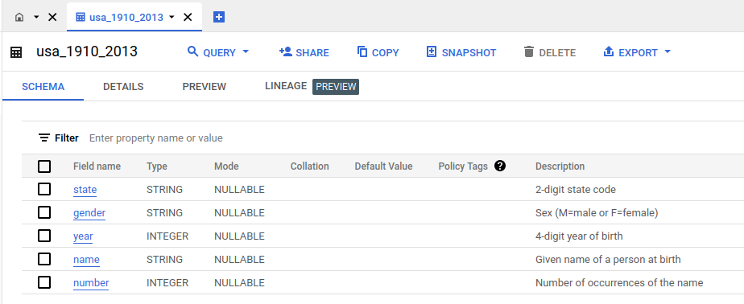
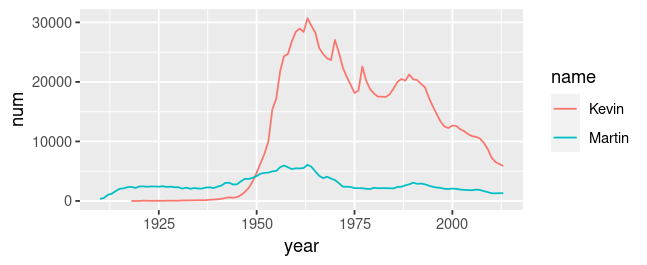

# Topics

- Data 
    - Data cleaning
    - Data merging
    - Data pipeline
- Machine Learning
    - General idea
    - Feature engineering
    - Prediction
    - Validation
- Reporting
    - Website
    - Visuals
- Collaboration
    - Version control
    - Reproducibility
    - Open Science


# This tutorial

- Shows you ways to **retrieve data from the internet**
- Starts from practical problems
- Is really **hands-on to reach a solution**. Try to follow along!
- Makes some inputs to discuss **background knowledge**

. . . 

**Disclaimer:** I am not an specialist! I showcase how to approach retrieval problems with limited knowledge using the right mix of searching, learning, trial and error analysis, and endurance. 

- **Ask questions!**


# Tutorial for Independent Study

**USA baby names from Google Cloud BigQuery (SQL)**

This tutorial is for the independent study project. It shows how to retrieve data from the internet using SQL queries on Google Cloud BigQuery. The data is about baby names in the USA.

**SQL** is a language to query databases. You should learn some basics sometimes, because every larger amount of data is stored in such databases. 

Preliminaries: `install.packages("bigrquery")` (It is assumed you have the `tidyverse` package.) 


## Google Cloud BigQuery Public Datasets

- We use the [Google Cloud Platform](https://en.wikipedia.org/wiki/Google_Cloud_Platform) which offers several cloud computing services based on Google's infrastructure.
- We use the service [BigQuery](https://cloud.google.com/bigquery) which is the [data warehouse](https://en.wikipedia.org/wiki/Data_warehouse) of Google Cloud.
- There is a sandbox mode which does not require anymore than a Google Account. (There is even no Free Trial registration or Credit Card Detail necessary!) <https://console.cloud.google.com/bigquery>

  
## Google Cloud BigQuery Sandbox

There is a sandbox mode which does not require anymore than a *Google Account*. No Free Trial registration or Credit Card Details necessary.

1. Go to <https://console.cloud.google.com/bigquery>. If necessary, log in with a Google Account.
2. Click on "Create Project". Leaving the default specification. Create the project. 
3. Go to the "SQL workspace" (if you are not already there)
4. In the "Explorer" click "Add Data", select "Public Datasets", search for "usa names", click on the data set "USA Names", and then "View Dataset". 
4. The `bigquery-public-data` should appear in the Explorer. 
5. Use pressing the triangle to navigate the hierarchy in the Explorer. Go to the dataset `usa_names` and then click on its table `usa_1910_2013`. To the right should appear a tab with information about the table. 

## USA Names dataset in BigQuery




## Input: Databases and SQL

- Structured Query Language (SQL) is a language to query [relational databases](https://en.wikipedia.org/wiki/Relational_database). 
- A relational database
  1. presents data to users in the form of a collection of tables with rows and columns, and
  2. provides relational operators to manipulate the data in tabular form.
- SQL is somehow a standard but may come in different flavors
- Some call it "S,Q,L", other "SEQUEL"

 

## Input: Database = data frame?

- Tables in a database are indeed essentially the same as data frames in R, or python-pandas.

**What is the different use cases?**

- SQL databases are  
  - for storing and querying **large** amounts of data
  - often being access through a network 
  - often so large to be distributed over several severs
- The data frames in our data science tools are for smaller datasets to manipulate and analyze then within a programming environment and typically in memory. 


## Let's do a SQL query on USA Names!

On the BigQuery interface The tab for the table `usa_1910_2013` shows

- The table **Schema** which shows names and data types of the **columns**.   
  What are the columns in USA Names?
- Some **Details** about the data in the table: Metadate and data about Storage
- A **preview** of the first rows of the table

1. Select "Query" --> "In split tab" to open a new tab for our query. 
2. We want to extract the numbers of babies with the name "Kevin" for each year in the whole USA.
3. Copy this query

```sql
SELECT year, sum(number) AS num
FROM `bigquery-public-data.usa_names.usa_1910_2013`
WHERE name = "Kevin"
GROUP BY year
```

4. Click "Run" and explore the results. 
 
 
## Explanations

```sql
SELECT year, sum(number) AS num
FROM `bigquery-public-data.usa_names.usa_1910_2013`
WHERE name = "Kevin"
GROUP BY year
```

- Line 1 specifies what columns we want to have. It also specifies that we compute a new variable `num` which is the sum of `number`. To that end, we need some `GROUP BY` which comes later in Line 4.
- Line 2 specifies the data table. Note the dot-notation with the database collection `bigquery-public-data`, the database `usa_names`, and the table `usa_1910_2013`
- Line 3 specifies a filter
- The line breaks are not relevant for the execution.  
- The UPPERCASE of the syntax words is not necessary and only a convention.


## Query from R {.nostretch}

Now, let's do the same query from R using a copy of the script `Tutorials/CollectingData_YOURNAME.R`.

1. Load the package `bigrquery`
2. Execute the `bq_auth()` command (check the text in the comments)
3. Use this code

```R
billing <- "blabla-380021"  # This must be your project ID! 
sql <- "SELECT year, sum(number
FROM `bigquery-public-data.usa_names.usa_1910_2013`
WHERE name = 'Kevin'
GROUP BY year"
tb <- bq_project_query(billing, sql)
data <- bq_table_download(tb, n_max = 100)
```

**Important:** Replace the `billing` string with your project ID. Find it clicking here 

{width=20%}

## Plot the data in R

Now we can look at the evolution of the popularity of the name "Kevin" with 

```R
data |> ggplot(aes(year, num, color = name)) + geom_line()
```

. . .

Next challenge: Extract also the data for the name "Martin". Hint: You need to add "Martin" (comma-separated) to the `SELECT` and add a condition with `OR` at the end of the `WHERE`. You also need to add `name` to the `GROUP BY`. 



## Learing SQL

Suppose we have the data frame `usa_names` in R or python. Then the same data wrangling operations are quite similar. 

:::: {.columns}

::: {.column width='33%'}
### SQL

```sql
SELECT year, sum(number) AS num
FROM `bigquery-public-data.usa_names.usa_1910_2013`
WHERE name = "Kevin"
GROUP BY year
```
:::
::: {.column width='33%'}
### R dplyr
```R
usa_names |> 
filter(name == "Kevin") |> 
select(year, number) |> 
group_by(year) |> 
summarize(num = sum(number))
```
:::
::: {.column width='33%'}
### py pandas
```python
usa_names.loc[usa_names['name'] == 'Kevin', 
['year', 'number']].\
groupby('year').\
agg(num=('number', 'sum'))
```
:::

- There are libraries for linking python or R to SQL databases
  - Use these when your data is in a database anyway
- It may even make sense to make some computations in a SQL query (often much faster!)
- **SQL skills are useful (often must-have) for data scientists!** Whenever there is an opportunity to learn a bit of SQL, take it!
- Basics are not too complicated. AI tools can help to translate!
::::
